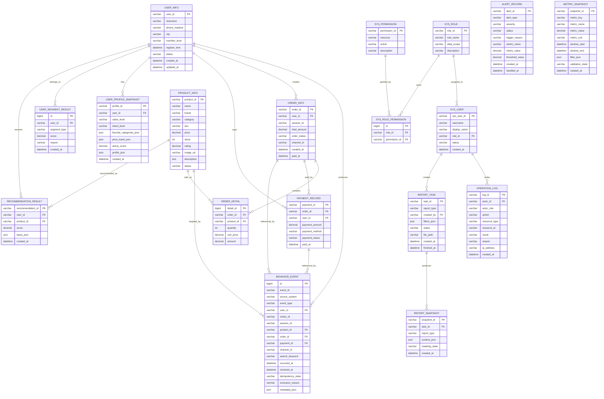
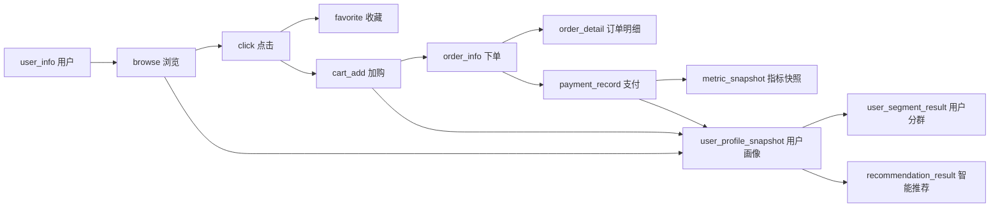
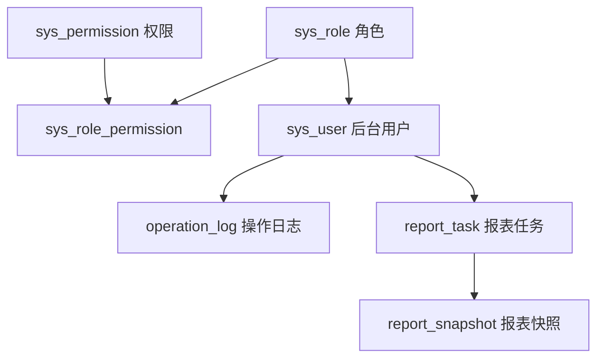

# 数据库 ER 图

## 1. 核心业务 ER 图

```mermaid
erDiagram
  USER_INFO ||--o{ BEHAVIOR_EVENT : produces
  USER_INFO ||--o{ ORDER_INFO : creates
  USER_INFO ||--o{ PAYMENT_RECORD : pays
  USER_INFO ||--o{ USER_PROFILE_SNAPSHOT : has
  USER_INFO ||--o{ USER_SEGMENT_RESULT : belongs_to
  USER_INFO ||--o{ RECOMMENDATION_RESULT : receives

  PRODUCT_INFO ||--o{ BEHAVIOR_EVENT : targeted_by
  PRODUCT_INFO ||--o{ ORDER_DETAIL : sold_as
  PRODUCT_INFO ||--o{ RECOMMENDATION_RESULT : recommended_as

  ORDER_INFO ||--o{ ORDER_DETAIL : contains
  ORDER_INFO ||--o{ PAYMENT_RECORD : paid_by
  ORDER_INFO ||--o{ BEHAVIOR_EVENT : referenced_by

  PAYMENT_RECORD ||--o{ BEHAVIOR_EVENT : referenced_by

  SYS_ROLE ||--o{ SYS_USER : assigned_to
  SYS_ROLE ||--o{ SYS_ROLE_PERMISSION : owns
  SYS_PERMISSION ||--o{ SYS_ROLE_PERMISSION : granted_by
  SYS_USER ||--o{ OPERATION_LOG : writes
  SYS_USER ||--o{ REPORT_TASK : creates

  REPORT_TASK ||--o{ REPORT_SNAPSHOT : produces

  USER_INFO {
    varchar user_id PK
    varchar nickname
    varchar phone_masked
    varchar city
    varchar member_level
    datetime register_time
    varchar status
    datetime created_at
    datetime updated_at
  }

  PRODUCT_INFO {
    varchar product_id PK
    varchar name
    varchar brand
    varchar category
    varchar sku
    decimal price
    int stock
    decimal rating
    varchar image_url
    text description
    varchar status
  }

  BEHAVIOR_EVENT {
    bigint id PK
    varchar event_id
    varchar source_system
    varchar event_type
    varchar user_id FK
    varchar visitor_id
    varchar session_id
    varchar product_id FK
    varchar order_id FK
    varchar payment_id FK
    varchar channel_id
    varchar search_keyword
    datetime occurred_at
    datetime received_at
    varchar idempotency_state
    varchar exclusion_reason
    json metadata_json
  }

  ORDER_INFO {
    varchar order_id PK
    varchar user_id FK
    varchar session_id
    decimal total_amount
    varchar order_status
    varchar channel_id
    datetime created_at
    datetime paid_at
  }

  ORDER_DETAIL {
    bigint detail_id PK
    varchar order_id FK
    varchar product_id FK
    int quantity
    decimal unit_price
    decimal amount
  }

  PAYMENT_RECORD {
    varchar payment_id PK
    varchar order_id FK
    varchar user_id FK
    decimal payment_amount
    varchar payment_method
    varchar payment_status
    datetime paid_at
  }

  USER_PROFILE_SNAPSHOT {
    varchar profile_id PK
    varchar user_id FK
    varchar value_level
    varchar intent_level
    json favorite_categories_json
    json price_band_json
    decimal active_score
    json profile_json
    datetime created_at
  }

  USER_SEGMENT_RESULT {
    bigint id PK
    varchar user_id FK
    varchar segment_type
    decimal score
    varchar reason
    datetime created_at
  }

  RECOMMENDATION_RESULT {
    varchar recommendation_id PK
    varchar user_id FK
    varchar product_id FK
    decimal score
    json basis_json
    datetime created_at
  }

  ALERT_RECORD {
    varchar alert_id PK
    varchar alert_type
    varchar severity
    varchar status
    varchar trigger_reason
    varchar metric_name
    decimal metric_value
    decimal threshold_value
    datetime created_at
    datetime handled_at
  }

  METRIC_SNAPSHOT {
    varchar snapshot_id PK
    varchar metric_key
    varchar metric_name
    decimal metric_value
    varchar metric_unit
    datetime window_start
    datetime window_end
    json filter_json
    varchar validation_state
    datetime created_at
  }

  SYS_USER {
    varchar sys_user_id PK
    varchar username
    varchar display_name
    varchar role_id FK
    varchar status
    datetime created_at
  }

  SYS_ROLE {
    varchar role_id PK
    varchar role_name
    varchar data_scope
    varchar description
  }

  SYS_PERMISSION {
    varchar permission_id PK
    varchar resource
    varchar action
    varchar description
  }

  SYS_ROLE_PERMISSION {
    bigint id PK
    varchar role_id FK
    varchar permission_id FK
  }

  OPERATION_LOG {
    varchar log_id PK
    varchar actor_id FK
    varchar actor_role
    varchar action
    varchar resource_type
    varchar resource_id
    varchar result
    varchar reason
    varchar ip_address
    datetime created_at
  }

  REPORT_TASK {
    varchar task_id PK
    varchar report_type
    varchar created_by FK
    json filters_json
    varchar status
    varchar file_path
    datetime created_at
    datetime finished_at
  }

  REPORT_SNAPSHOT {
    varchar snapshot_id PK
    varchar task_id FK
    varchar report_type
    json content_json
    varchar masking_state
    datetime created_at
  }
```

## 2. 行为链路关系

```mermaid
flowchart LR
  User["user_info 用户"] --> Browse["browse 浏览"]
  Browse --> Click["click 点击"]
  Click --> Favorite["favorite 收藏"]
  Click --> Cart["cart_add 加购"]
  Cart --> Order["order_info 下单"]
  Order --> Detail["order_detail 订单明细"]
  Order --> Payment["payment_record 支付"]
  Payment --> Metrics["metric_snapshot 指标快照"]
  Browse --> Profile["user_profile_snapshot 用户画像"]
  Cart --> Profile
  Payment --> Profile
  Profile --> Segment["user_segment_result 用户分群"]
  Profile --> Recommend["recommendation_result 智能推荐"]
```

## 3. 权限审计关系

```mermaid
flowchart TB
  Role["sys_role 角色"] --> RolePermission["sys_role_permission"]
  Permission["sys_permission 权限"] --> RolePermission
  Role --> SysUser["sys_user 后台用户"]
  SysUser --> OperationLog["operation_log 操作日志"]
  SysUser --> ReportTask["report_task 报表任务"]
  ReportTask --> ReportSnapshot["report_snapshot 报表快照"]
```
