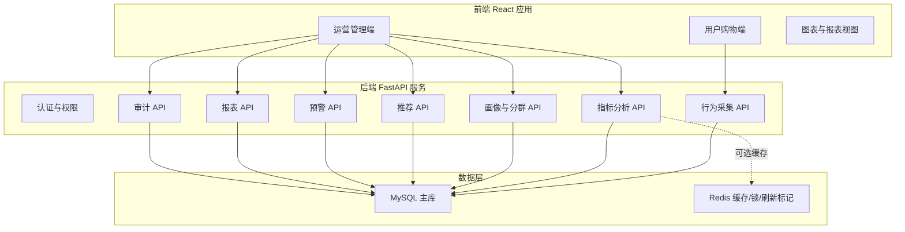

# 系统技术方案

## 1. 技术选型结论

项目继续推进当前工程实现，采用如下技术基线：

| 层级 | 技术 | 说明 |
|---|---|---|
| 前端 | React + TypeScript + Vite | 保留当前项目基础，适合复杂仪表盘和用户购物端交互 |
| 后端 | FastAPI + Pydantic | 开发效率高，接口文档自动生成，适合数据分析类系统 |
| ORM | SQLAlchemy | 连接 MySQL，管理业务实体和查询 |
| 数据库 | MySQL 8.x | 系统主数据库，存储用户、商品、行为、订单、画像、审计 |
| 迁移 | Alembic | 管理数据库表结构版本 |
| 缓存 | Redis | 可选增强，用于热点指标缓存、刷新状态和任务锁 |
| 图表 | ECharts / 前端图表组件 | 展示漏斗、饼图、排行、趋势 |
| 测试 | pytest + Playwright | 后端单元/集成测试，前端端到端测试 |
| 部署 | Docker Compose | 本地和演示环境启动 MySQL、Redis、后端、前端 |

## 2. 为什么不重写为 Spring Boot + Vue

原需求文档中的 Spring Boot + Vue3 + Element Plus 是一个可行方案，但当前项目已经形成 FastAPI + React 的可运行原型。若重写为 Spring Boot + Vue，会产生较大返工成本。

保留当前技术栈的理由：

1. 当前已有前后端接口、角色分流、用户购物端、运营端看板。
2. Python 更适合快速实现用户画像、推荐算法、异常检测等分析逻辑。
3. FastAPI 自动生成 Swagger，便于接口调试和验收演示。
4. React 更适合复杂状态和多角色页面切换。
5. 当前最关键缺口是 MySQL 持久化，而不是前端或后端框架本身。

## 3. 总体架构



## 4. 前端架构

### 4.1 目录规划

```text
frontend/
  src/
    components/       # 通用组件、图表组件、筛选组件
    pages/            # 管理端页面
    services/         # API 请求封装
    state/            # 登录态、角色、全局状态
    App.tsx           # 应用入口和路由/角色分流
```

### 4.2 前端职责

- 展示商品、购物、推荐和管理页面。
- 根据用户角色显示不同功能菜单。
- 调用后端 API 获取数据。
- 不直接持久化业务数据。
- 不在前端作为唯一计算来源。

## 5. 后端架构

### 5.1 目录规划

```text
backend/
  src/
    api/              # FastAPI 路由、请求响应模型
    analytics/        # 指标、漏斗、商品热度算法
    services/         # 行为、画像、推荐、报表服务
    models/           # SQLAlchemy ORM 模型
    security/         # 权限、审计、脱敏
    reports/          # 报表生成
    jobs/             # 定时任务和异步任务
```

### 5.2 后端职责

- 接收并校验用户行为。
- 写入 MySQL。
- 读取 MySQL 计算指标。
- 校验角色权限。
- 记录操作日志。
- 生成画像、分群、推荐、预警和报表数据。

## 6. MySQL 数据方案

### 6.1 数据库定位

MySQL 是系统唯一可信业务数据源。所有核心数据必须落库：

- 用户
- 商品
- 用户行为
- 订单
- 支付
- 系统用户
- 权限角色
- 操作日志
- 指标快照
- 画像快照
- 推荐结果
- 报表任务

### 6.2 第一阶段不做内容

根据当前项目目标，以下内容暂不作为第一阶段范围：

- HTTPS 证书配置
- bcrypt 密码加密
- 生产级安全加固
- 千万级压测
- MySQL 分区表
- 大规模分库分表

## 7. Redis 使用边界

Redis 作为增强组件，不作为第一阶段核心依赖。

可用于：

- 看板热点指标缓存。
- 数据刷新时间标记。
- 报表任务锁。
- 防止重复任务执行。
- 短期会话状态。

不用于：

- 替代 MySQL 持久化。
- 存储长期行为数据。

## 8. API 设计

当前主要 API：

| API | 说明 |
|---|---|
| `POST /api/events/behavior` | 批量上报用户行为 |
| `GET /api/behavior/events` | 查询行为明细 |
| `GET /api/behavior/journeys/{subject_id}` | 查询用户行为路径 |
| `GET /api/analytics/behavior-summary` | 查询核心指标 |
| `GET /api/analytics/funnel` | 查询转化漏斗 |
| `GET /api/analytics/product-heat` | 查询商品热度 |
| `GET /api/profiles/{user_id}` | 查询用户画像 |
| `GET /api/segments` | 查询用户分群 |
| `GET /api/purchase-intent/users` | 查询购买意向 |
| `GET /api/alerts` | 查询预警 |
| `GET /api/recommendations/analysis` | 查询推荐分析 |
| `GET /api/reports` | 查询报表 |
| `POST /api/reports/{report_type}/exports` | 创建导出任务 |
| `GET /api/audit-logs` | 查询审计日志 |
| `POST /api/system/reset` | 管理员重置演示数据 |

## 9. 权限方案

第一阶段角色：

- administrator
- operations_manager
- analyst
- customer_service_viewer
- read_only_viewer

权限控制策略：

1. 前端根据角色显示菜单。
2. 后端根据请求头或登录态识别角色。
3. 后端接口校验角色是否允许访问。
4. 敏感字段根据角色脱敏。
5. 关键操作写入审计日志。

## 10. 迭代路线

### 10.1 第一阶段

- MySQL 表结构落地。
- 行为事件写入 MySQL。
- 商品、用户、订单、支付落库。
- 指标、漏斗、热度从 MySQL 计算。

### 10.2 第二阶段

- 用户画像、分群、推荐后端化。
- RBAC 权限表落地。
- 操作日志落 MySQL。

### 10.3 第三阶段

- 报表导出文件生成。
- Redis 缓存热点指标。
- 异常预警规则配置。

### 10.4 后续增强

- 登录认证。
- 密码加密。
- HTTPS。
- 压测和性能优化。
