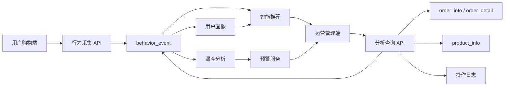

# 系统模块拆分文档

## 1. 模块划分原则

智能零售用户行为分析系统按照“用户端产生行为、后端沉淀数据、运营端分析决策”的业务链路拆分模块。模块边界以数据职责和使用角色为依据，避免前端页面直接承担核心业务计算。

系统整体拆分为 6 层：

1. 用户购物端
2. 运营管理端
3. 后端 API 服务
4. 分析计算服务
5. 数据持久化层
6. 安全与审计支撑

## 2. 前端应用模块

### 2.1 角色分流模块

功能：

- 根据角色标识或账号信息识别用户角色。
- 内部管理角色进入对应工作台。
- 普通零售用户进入购物端。
- 前端只展示当前角色允许访问的菜单。

角色入口：

- `admin001`：系统管理员
- `ops001`：运营经理
- `analyst001`：数据分析师
- `service001`：客服主管
- `viewer001`：只读查看员
- `user001`、`user002`、`user003`：零售用户

### 2.2 用户购物端模块

功能：

- 商品搜索
- 商品分类筛选
- 商品列表展示
- 商品详情展示
- 收藏商品
- 加入购物车
- 下单并支付
- 推荐商品展示

自动采集行为：

- 搜索行为
- 浏览行为
- 点击行为
- 收藏行为
- 加购行为
- 下单行为
- 支付行为

### 2.3 运营总览模块

功能：

- 访问量
- 点击量
- 加购量
- 订单量
- 销售额
- 转化率
- 渠道来源
- 商品热度摘要
- 预警摘要

数据来源：

- `behavior_event`
- `order_info`
- `payment_record`
- `metric_snapshot`

### 2.4 行为明细模块

功能：

- 查看用户行为流水
- 按时间、商品、用户、渠道、行为类型筛选
- 展示幂等状态
- 展示行为来源渠道
- 支持追踪单用户行为路径

数据来源：

- `behavior_event`
- `user_info`
- `product_info`

### 2.5 转化漏斗模块

功能：

- 浏览到点击转化
- 点击到加购转化
- 加购到下单转化
- 下单到支付转化
- 流失人数和流失率展示
- 最大流失环节识别

数据来源：

- `behavior_event`
- `order_info`
- `payment_record`

### 2.6 商品热度模块

功能：

- 商品浏览排行
- 商品点击排行
- 商品收藏排行
- 商品加购排行
- 商品购买排行
- 商品转化率排行

数据来源：

- `product_info`
- `behavior_event`
- `order_detail`
- `payment_record`

### 2.7 用户画像模块

功能：

- 用户基础画像
- 消费能力画像
- 兴趣偏好画像
- 活跃度画像
- 用户价值等级
- 类目偏好饼图
- 价位偏好饼图

数据来源：

- `user_info`
- `behavior_event`
- `order_info`
- `order_detail`

### 2.8 用户分群模块

功能：

- 高价值用户
- 潜力用户
- 新用户
- 价格敏感用户
- 沉默用户
- 流失风险用户

分群结果可以实时计算，也可以周期性写入 `user_segment_result`。

### 2.9 智能推荐模块

功能：

- 基于浏览记录推荐
- 基于购买记录推荐
- 基于相似用户推荐
- 基于用户画像推荐
- 推荐分展示
- 推荐原因展示

数据来源：

- `behavior_event`
- `product_info`
- `order_detail`
- `user_profile_snapshot`
- `recommendation_result`

### 2.10 预警中心模块

功能：

- 低活跃提醒
- 流失风险预警
- 转化异常预警
- 行为数据异常预警
- 预警处理状态流转

数据来源：

- `alert_record`
- `metric_snapshot`
- `behavior_event`

### 2.11 报表统计模块

功能：

- 用户行为明细报表
- 商品分析报表
- 转化漏斗报表
- 用户画像报表
- 用户分群报表
- 销售转化报表
- 运营效果报表

数据来源：

- `report_task`
- `report_snapshot`
- 业务分析表

### 2.12 审计日志模块

功能：

- 查看角色访问日志
- 查看查询日志
- 查看导出日志
- 查看系统配置修改日志
- 查看敏感数据访问日志

数据来源：

- `operation_log`

## 3. 后端服务模块

### 3.1 行为采集服务

职责：

- 接收前端批量行为事件。
- 校验事件字段完整性。
- 执行幂等去重。
- 写入 MySQL。
- 返回 accepted、duplicate、invalid 等处理状态。

### 3.2 行为查询服务

职责：

- 根据筛选条件查询行为明细。
- 查询单用户行为时间线。
- 按角色进行数据范围控制。

### 3.3 指标统计服务

职责：

- 统计访问量、点击量、加购量、订单量、销售额、转化率。
- 保证指标非负。
- 保证比例类指标在 0 到 100 之间。

### 3.4 漏斗分析服务

职责：

- 计算各转化阶段人数。
- 计算阶段转化率和流失率。
- 标记最大流失环节。

### 3.5 商品分析服务

职责：

- 计算商品行为热度。
- 计算商品支付转化率。
- 生成商品排行。

### 3.6 用户画像服务

职责：

- 汇总用户行为偏好。
- 计算消费能力。
- 计算活跃度。
- 计算用户价值等级。

### 3.7 推荐服务

职责：

- 计算用户类目偏好。
- 计算价位偏好。
- 结合商品热度和未购买商品生成推荐。
- 输出推荐分和推荐理由。

### 3.8 预警服务

职责：

- 检测指标异常。
- 检测转化异常。
- 检测低活跃和流失风险。
- 记录预警处理状态。

### 3.9 权限与审计服务

职责：

- 识别当前操作者。
- 校验角色权限。
- 记录关键操作日志。
- 对敏感字段进行脱敏。

### 3.10 报表服务

职责：

- 创建报表任务。
- 生成报表快照。
- 记录导出状态。
- 管理导出文件路径。

## 4. 数据模块

核心数据表：

- `user_info`
- `product_info`
- `behavior_event`
- `order_info`
- `order_detail`
- `payment_record`
- `sys_user`
- `sys_role`
- `sys_permission`
- `operation_log`
- `metric_snapshot`
- `user_profile_snapshot`
- `user_segment_result`
- `alert_record`
- `recommendation_result`
- `report_task`
- `report_snapshot`

## 5. 模块依赖关系

